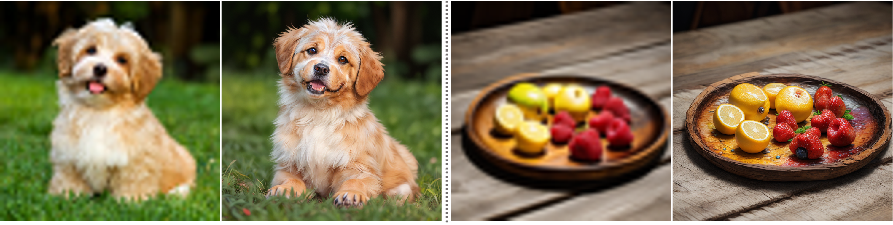
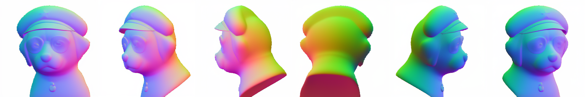
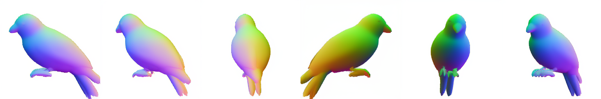
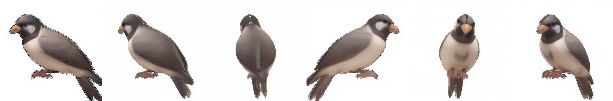
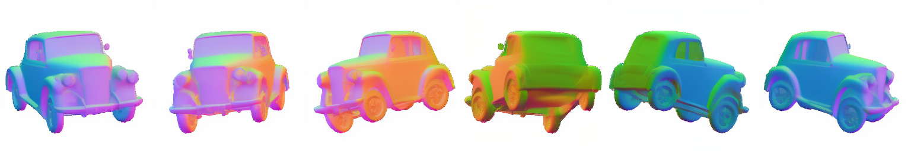
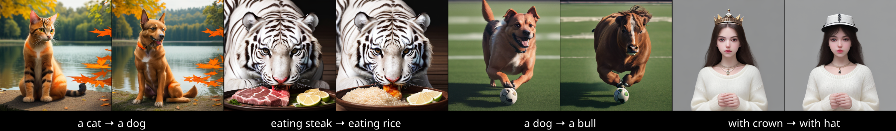
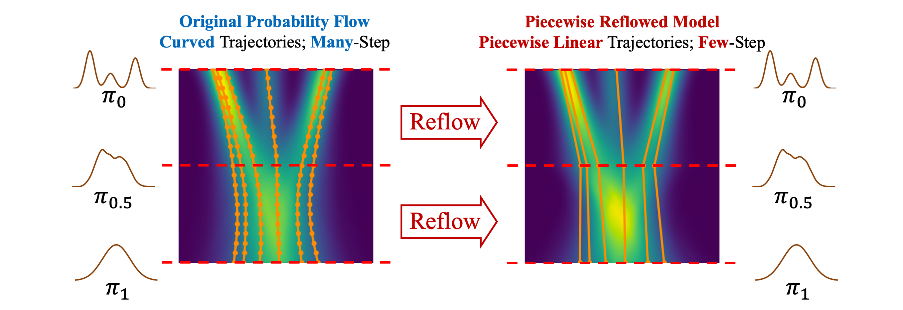

<!-- main documents -->

<div align="center">


# PeRFlow: Piecewise Rectified Flow as Universal Plug-and-Play Accelerator

[Hanshu Yan](https://hanshuyan.github.io/)<sup>1</sup>, [Xingchao Liu](https://gnobitab.github.io/)<sup>2</sup>, [Jiachun Pan](https://scholar.google.com/citations?hl=en&user=nrOvfb4AAAAJ&view_op=list_works&sortby=pubdate)<sup>3</sup>, [Jun Hao Liew](https://scholar.google.com.sg/citations?user=8gm-CYYAAAAJ&hl=en)<sup>1</sup>, [Qiang Liu](https://www.cs.utexas.edu/~lqiang/)<sup>2</sup>, [Jiashi Feng](https://scholar.google.com/citations?user=Q8iay0gAAAAJ&hl=en&oi=ao)<sup>1</sup>  
<sup>1</sup>ByteDance &nbsp; <sup>2</sup>UT Austin &nbsp; <sup>3</sup>NUS


[🔰 Project Page](https://piecewise-rectified-flow.github.io)
&nbsp;|&nbsp;
[🤗 Models](https://huggingface.co/hansyan) 
<!-- [[(🔥New) Code and Pre-trained Models](https://github.com/gnobitab/)] -->
Contributions are welcomed!
</div>

## 🔥 News 
- 2024/03/05 PeRFlow+Wonder3D gives one-step multiview generation! See [here](#efficient-multiview-generation-via-perflow-wonder3d).
- 2024/03/05 Training scripts are released. Run with ```bash scripts/train.sh```
- 2024/02/29 We released the PeRFlow accelerated version of Stable Diffusion v2.1.
- 2024/02/19 We released the PeRFlow acceleration module for Stable Diffusion v1.5, supporting various SD-v1.5 pipelines. Find inference scripts at ```scripts```.
<!-- [Demos](https://github.com/magic-research/piecewise-rectified-flow/tree/main/scripts) for few-step text-to-image and image-enhancement are provided. -->

## Introduction

Rectified Flow is a promising way for accelerating pre-trained diffusion models. However, the generation quality of prior fast flow-based models on Stable Diffusion (such as [InstaFlow](https://github.com/gnobitab/InstaFlow)) is unsatisfactory. 
In this work, we did several improvements to the original reflow pipeline to significantly boost the performance of flow-based fast SD.
Our new model learns a piecewise linear probability flow which can efficiently generate **high-quality** images in just **4 steps**, termed **piecewise rectified flow (PeRFlow)**.
Moreover, we found the difference of model weights, ${\Delta}W = W_{\text{PeRFlow}} - W_{\text{SD}}$, can be used as a plug-and-play accelerator module on a wide-range of SD-based models.

Specifically, PeRFlow has several **features**: 

- ```Fast Generation``` : PeRFlow can generate high-fidelity images in just 4 steps. The images generated from PeRFlow are more diverse than other fast-sampling models (such as [LCM](https://github.com/luosiallen/latent-consistency-model)). Moreover, as PeRFlow is a continuous probability flow, it supports 8-step, 16-step, or even higher number of sampling steps to monotonically increase the generation quality.  
- ```Efficient Training```: Fine-tuning PeRFlow based on SD 1.5 converges in just **4,000** training iterations (with a batch size of 1024). In comparison, previous fast flow-based text-to-image model, [InstaFlow](https://github.com/gnobitab/InstaFlow), requires 25,000 training iteration with the same batch size in fine-tuning. Besides, PeRFlow does not require heavy data generation for reflow. 
- ```Compatible with SD Workflows```: PeRFlow works with various stylized LORAs and generation/editing pipelines of the pretrained SD model.
  As a plug-and-play module, $\Delta W$ can be directly combined with other conditional generation pipelines, such as ControlNet, IP-Adaptor, multi-view generation.
- ```Classifier-Free Guidance``` : PeRFlow is fully compatible with classifier-free guidance and supports negative prompts, which are important for pushing the generation quality to even higher level. Empirically, the CFG scale is similar to the original diffusion model.


## Applications
### Fast image generation via PeRFlow-T2I
Generate high-quality images (512x512) with only 4 steps!
<p align="middle">
  
<p>

<!-- A real-time demo: -->


### Image enhancement via PeRFlow-Refiner
By plugging PeRFlow ${\Delta}W$ into the [ControlNet-Tile](https://huggingface.co/lllyasviel/control_v11f1e_sd15_tile) pipeline, we obtain PeRFlow-Refiner to upsample/refine images.
We can use PeRFlow-T2I and PeRFlow-Refiner together to generate astonishing x1024 images with lightweight SD-v1.5 backbones. We use 4-step PeRFlow-T2I to generate x512 images first, then upsample them to x1024 with 4-step PeRFlow-Refiner. 

<p align="middle">
  
</p>

One also can use PeRFlow-Refiner separately to enhance texture and details of low-res blurry images. Here are two examples: on the left, from x64 to x1024, and on the right, from x256 to x1024.
<p align="middle">
  
</p>


### Efficient multiview generation via PeRFlow-Wonder3D
*One*-step image-to-multiview is enabled by plugging PeRFlow $\Delta W$ into pre-trained [Wonder3D](https://github.com/xxlong0/Wonder3D). We can use PeRFlow-T2I and PeRFlow-Wonder3D together to generate multiview normal maps and textures from text prompts instantly. Here shows "a dog with glasses and cap", "a bird", and "a vintage car".
<p align="middle">
  
  
  
  
  
  
</p>

<!-- A real-time video demo: -->
<!-- <p align="middle">
  <video width="512" height="auto" controls>
    <source src="[assets/gallery/multiview/perflow_wonder3d.mp4](https://github.com/HanshuYAN/perflow-dev/assets/29773276/716b004c-8919-470d-8299-1a59bd232914)" type="video/mp4">
  </video>
</p> -->


### Accelerate other SD pipelines via PeRFlow
Plug PeRFlow ${\Delta}W$ into [controlnets](https://huggingface.co/lllyasviel) of SD-v1.5. 
<p align="middle">
  
</p>

Plug PeRFlow ${\Delta}W$ into [IP-adaptor](https://github.com/tencent-ailab/IP-Adapter).
<p align="middle">
  
</p>

Editting with PeRFlow+[Prompt-to-Prompt](https://github.com/google/prompt-to-prompt)
<p align="middle">
  
</p>


*Please refer to the [project page](https://piecewise-rectified-flow.github.io) for more results, including the comparison to LCM.*


## Demo Code

Install environments with,

```
bash env/install.sh
```

PeRFlow acceleration yields the delta_weights ${\Delta}W$ corresponding to the pretrained SD-v1.5 model. The complete weights of UNet for inference are computed by $W = W_{\text{SD}} + {\Delta}W$, where $W_{\text{SD}}$ can be the vanilla SD-v1.5 model or its finetuned stylized versions. We provide the delta_weights for SD-v1.5 at [PeRFlow🤗](https://huggingface.co/hansyan). You can download the delta-weights and fuse them into your own SD pipelines. 

```python
import torch, torchvision
from diffusers import StableDiffusionPipeline, UNet2DConditionModel
from src.utils_perflow import merge_delta_weights_into_unet
from src.scheduler_perflow import PeRFlowScheduler
delta_weights = UNet2DConditionModel.from_pretrained("hansyan/perflow-sd15-delta-weights", torch_dtype=torch.float16, variant="v0-1",).state_dict()
pipe = StableDiffusionPipeline.from_pretrained("Lykon/dreamshaper-8", torch_dtype=torch.float16,)
pipe = merge_delta_weights_into_unet(pipe, delta_weights)
pipe.scheduler = PeRFlowScheduler.from_config(pipe.scheduler.config, prediction_type="epsilon", num_time_windows=4)
pipe.to("cuda", torch.float16)
```

**For easy try**, we also provide the whole accelerated model of several popular base diffusion models (already merged with PeRFlow), including DreamShaper-v8, RealisticVision-v51, and ArchitectureExterior. Load the model, change the scheduler, then enjoy the fast generation.

```python
import torch, torchvision
from diffusers.pipelines.stable_diffusion import StableDiffusionPipeline
from src.scheduler_perflow import PeRFlowScheduler
pipe = StableDiffusionPipeline.from_pretrained("hansyan/perflow-sd15-dreamshaper", torch_dtype=torch.float16)
pipe.scheduler = PeRFlowScheduler.from_config(pipe.scheduler.config, prediction_type="epsilon", num_time_windows=4)
pipe.to("cuda", torch.float16)

prompts_list = ["A man with brown skin, a beard, and dark eyes", "A colorful bird standing on the tree, open beak",]
for i, prompt in enumerate(prompts_list):
    generator = torch.Generator("cuda").manual_seed(1024)
    prompt = "RAW photo, 8k uhd, dslr, high quality, film grain, highly detailed, masterpiece; " + prompt
    neg_prompt = "distorted, blur, smooth, low-quality, warm, haze, over-saturated, high-contrast, out of focus, dark"
    samples = pipe(
        prompt              = [prompt], 
        negative_prompt     = [neg_prompt],
        height              = 512,
        width               = 512,
        num_inference_steps = 8, 
        guidance_scale      = 7.5,
        generator           = generator,
        output_type         = 'pt',
    ).images
    torchvision.utils.save_image(torchvision.utils.make_grid(samples, nrow=4), f"tmp_{i}.png")
```

We provide complete python scripts and the running dependencies in ```scripts``` and ```env```. Scripts for text-to-image and controlnet (depth/edge/pose/tile) are included. You can try efficient image enhancement via controlnet-tile models. We will release other accelerated models and training details in future.

We provide fast text-to-multiview gradio interface in ```./Wonder3D``` based on [Wonder3D](https://github.com/xxlong0/Wonder3D).
Install ```diffusers 0.19.3``` with ```pip install diffusers==0.19.3``` before running.
Run by 

```
python Wonder3D/sd15_t2mv_gradio.py
```

In the Gradio interface, hit 'enter' to generate the multiview images after typing the text.


## Method: Accelerating Diffusion Models with Piecewise Rectified Flows

[Rectified Flows](https://github.com/gnobitab/RectifiedFlow) proposes to contruct flow-based generative models via linear interpolation, and the trajectories of the learned flow can be straightened with a special operation called **reflow**. 
However, the reflow procedure requires generating a synthetic dataset by simulating the entire pre-trained probability flow, which consumes a huge amount of storage and time, making it unfavorable for training large-scale foundation models.
To address this limitation, we propose **piecewise rectified flow**. By dividing the pre-trained probability flows into multiple segments and straightening the intermediate probability flows inside each segment with reflow, we yield a piecewise linear probability flow that can be sampled within very few steps.
This divide-and-conquer strategy successfully avoids the cumbersome simulation of the whole ODE trajectory, thereby allowing us to perform the piecewise reflow operation online in training.

<p align="middle">
  
</p>

As shown in the figure, the pre-trained probability flow (which can be transformed from a pre-trained diffusion model) maps random noise distribution $\pi_0$, to the data distribution $\pi_1$. 
It requires many steps to sample from the curved flow with ODE solvers.
Instead, PeRFlow divides the sampling trajectories into multiple segments (two as an example here), and straightens each segment with the reflow operation. 
A well-trained PeRFlow can generate high-quality images in very few steps because of its piecewise linear nature. 

**Quantitative Results:**    We train a PeRFlow model on LAION-aesthetic-v2 data to accelerate SD-v1.5. We compare the FID with respect to three datasets, including: (1) a subset of 30K images from LAION,  (2) a set of 30K images generated from SD-v1.5 with the [JourneyDB](https://huggingface.co/datasets/JourneyDB/JourneyDB) prompts, (3) the validation set of MS-COCO2014. For all these datasets, we generate 30K images with different models using the corresponding text prompts. The results are presented in the following table. PeRFlow has lower FIDs in all the three comparisons according to the numerical results.

<div align="center" style="font-size:12px;">
  <table>
      <tr>
          <th style="text-align:center;"></th>
          <th colspan="2" style="text-align:center;">LAION5B-30k</th>
          <th colspan="2" style="text-align:center;">SD-v1.5</th>
          <th colspan="2" style="text-align:center;">COCO2014-30k</th>
      </tr>
      <tr>
          <td style="text-align:center;"><strong>FID</strong></td>
          <td style="text-align:center;"><strong>4-step</strong></td>
          <td style="text-align:center;"><strong>8-step</strong></td>
          <td style="text-align:center;"><strong>4-step</strong></td>
          <td style="text-align:center;"><strong>8-step</strong></td>
          <td style="text-align:center;"><strong>4-step</strong></td>
          <td style="text-align:center;"><strong>8-step</strong></td>
      </tr>
      <tr>
          <td style="text-align:center;">PeRFlow</td>
          <td style="text-align:center;">9.74</td>
          <td style="text-align:center;">8.62</td>
          <td style="text-align:center;">9.46</td>
          <td style="text-align:center;">5.05</td>
          <td style="text-align:center;">11.31</td>
          <td style="text-align:center;">14.16</td>
      </tr>
      <tr>
          <td style="text-align:center;">LCM</td>
          <td style="text-align:center;">15.38</td>
          <td style="text-align:center;">19.21</td>
          <td style="text-align:center;">15.63</td>
          <td style="text-align:center;">21.19</td>
          <td style="text-align:center;">23.49</td>
          <td style="text-align:center;">29.63</td>
      </tr>
  </table>
</div>

<br>


## Citation

```
@article{yan2024perflow,
  title={PeRFlow: Accelerating Diffusion Models with Piecewise Rectified Flows},
  author={Yan, Hanshu and Liu, Xingchao and Pan, Jiachun and Liew, Jun Hao and Liu, Qiang and Feng, Jiashi},
  year={2024},
  url={https://piecewise-rectified-flow.github.io}
}

```

## Related Materials

We provide several related links here:

* The official Rectified Flow github repo (https://github.com/gnobitab/RectifiedFlow)

* The official InstaFlow github repo (https://github.com/gnobitab/InstaFlow)

## Acknowledgements

Our training and evaluation scripts are implemented based on the [Diffusers and Accelerate](https://github.com/huggingface/) libraries. We use several high-quality finetuned versions of [Stable Diffusion](https://huggingface.co/runwayml/stable-diffusion-v1-5) for model evaluation, including [DreamShaper](https://civitai.com/user/Lykon), [RealisticVision](https://civitai.com/user/SG_161222/models), [LandscapeRealistic](https://civitai.com/user/Celsia/models), [ArchitectureExterior](https://civitai.com/user/Hoang_StablediffusionLife/models), [DisneyCartoon](https://civitai.com/user/PromptSharingSamaritan/models).

Xingchao Liu wishes to express his genuine gratitude to Nat Friedman and the Andromeda cluster for providing free GPU grants during this research.


<!-- (A) LOAD THE MATHJAX LIBRARY -->
<!-- DOCS: https://docs.mathjax.org/en/latest/basic/mathematics.html -->
<!-- DEMO: https://github.com/mathjax/MathJax-demos-web -->
<!-- <script src="https://polyfill.io/v3/polyfill.min.js?features=es6"></script>

<script id="MathJax-script" async src="https://cdn.jsdelivr.net/npm/mathjax@3/es5/tex-mml-chtml.js"></script> -->
