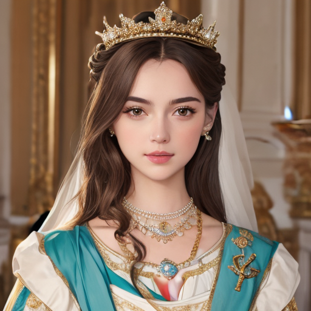
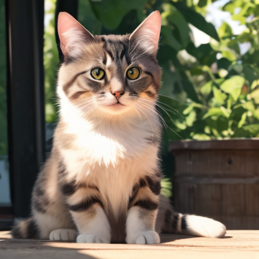
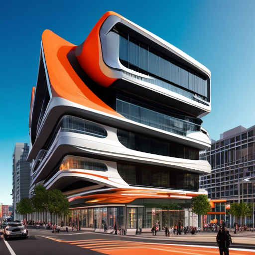

<!-- main documents -->
<div align="center">

# PeRFlow: Accelerating Diffusion Models with Piecewise Rectified Flows

[Hanshu Yan](https://hanshuyan.github.io/)<sup>1</sup>, [Xingchao Liu](https://gnobitab.github.io/)<sup>2</sup>, [Jiachun Pan](https://scholar.google.com/citations?hl=en&user=nrOvfb4AAAAJ&view_op=list_works&sortby=pubdate)<sup>3</sup>, [Jun Hao Liew](https://scholar.google.com.sg/citations?user=8gm-CYYAAAAJ&hl=en)<sup>1</sup>, [Qiang Liu](https://www.cs.utexas.edu/~lqiang/)<sup>2</sup>, [Jiashi Feng](https://scholar.google.com/citations?user=Q8iay0gAAAAJ&hl=en&oi=ao)<sup>1</sup>  
<sup>1</sup>ByteDance &nbsp; <sup>2</sup>UT Austin &nbsp; <sup>3</sup>NUS


[🔰 Project Page](https://piecewise-rectified-flow.github.io)
&nbsp;|&nbsp;
[🤗 Model](https://huggingface.co/hansyan) 
<!-- [[(🔥New) Code and Pre-trained Models](https://github.com/gnobitab/)] -->

</div>

<!-- ## News 
- 2024/02/19 We provide a demo in 🤗Hugging Face Space. Try it [here](https://huggingface.co). -->

## Introduction
Diffusion models are powerful generative models that exhibit impressive performances across different modality generation including image and video. However, existing diffusion models are slow in inference and usually require many steps to generate content. 
We propose an efficient flow model, termed *piecewise rectified flow* (PeRFlow), for diffusion model speed-up. PeRFlow divides the sampling trajectories of the pretrained diffusion model into multiple segments and approximate each segment with rectified flows. The training of PeRFlow converges fast, when accelerating Stable-Diffusion, we can obtain a four-step generative model within 4k training iterations. PeRFlow can work compatibly with various finetuned version of the pretrained diffusion model. For example, you can load various stylized dreambooth LORAs into PeRFlow for fast generation. PerFlow also can be directly used in other conditional generation pipelines, such as ControlNet and IP-Adaptor.

**PeRFlow** has several advantages: 
- ```Fast sampling and efficient training``` : PeRFlow can generate high-fidelity images in four steps. Increasing sampling steps to eight can further improve the image visual quality, like details and color style. The generated images of PeRFlow are more diverse than other fast-sampling methods, such as LCM. The acceleration process of Stable-Diffusion-v15 converges in 4k training iterations with a batch size of 1024.
- ```Compatible with SD workflows```: PeRFlow works compatibly with various stylized LORAs and generation/editing pipelines of the pretrained SD model. We compute the PeRFlow delta_weights by $\Delta W = W_{\text{PeRFlow}}-W_{\text{pretrained}}$. The delta_weights can be directly used with other stylization LORA and plugged into various SD pipelines.
- ```Supporting classifier-free-guidance``` : PeRFlow is fully compatible with classifier-free-guidance and supports negative/base-empty prompts. Many dreambooth LORAs generate astonishing images based on well-crafted negative and positive prompts, which trigger certain visual style and rich details. PeRFlow preserves the CFG property of the pretrained diffusion model, e.g., one can use a similar CFG-scale (e.g., 7.5) to the pretrained model when perform 8-step sampling. The resultant images are visually similar to the original ones.


## Gallery

### 4-step generation with PeRFlow $\small{(512 \times 512)}$

<p align="middle">
  
  
  
  
</p>

### 4-step PeRFlow T2I $\small{(512 \times 512)}$ + 4-step PeRFlow Refiner $\small{(1024 \times 1024)}$

<p align="middle">
  
  
</p>


Refer to the [project page](https://piecewise-rectified-flow.github.io) for more results, including the comparison to LCM and applying PeRFlow to SD pipelines (e.g., ControlNet, IP-Adaptor, Prompt2Prompt, and more).


## Demo
PeRFlow acceleration yields the delta_weights corresponding to the pretrained SD-v15 models. The complete weights of UNet for sampling are computed by $W = W_{\text{SD}} + \Delta W$. We provide the delta_weights of SD-v15 at [PeRFlow🤗](https://huggingface.co/hansyan). You can download the delta_weights and fuse them into your own SD pipelines. 
```python
import torch, torchvision
from diffusers import StableDiffusionPipeline, UNet2DConditionModel
from src.utils_perflow import merge_delta_weights_into_unet
from src.scheduler_perflow import PeRFlowScheduler
delta_weights = UNet2DConditionModel.from_pretrained("hansyan/piecewise-rectified-flow-delta-weights", torch_dtype=torch.float16, variant="v0-1",).state_dict()
pipe = StableDiffusionPipeline.from_pretrained("Lykon/dreamshaper-8", torch_dtype=torch.float16,)
pipe = merge_delta_weights_into_unet(pipe, delta_weights)
pipe.scheduler = PeRFlowScheduler.from_config(pipe.scheduler.config, prediction_type="epsilon", num_time_windows=4)
pipe.to("cuda", torch.float16)
```

**For easy try**, we also provide the accelerated complete model of several popular SD-v15 dreambooth models (already merged with PeRFLow), including DreamShaper-v8, RealisticVision-v51, and ArchitectureExterior. Load the model, change the scheduler, then enjoy the acceleration.

```python
import torch, torchvision
from diffusers.pipelines.stable_diffusion import StableDiffusionPipeline
from src.scheduler_perflow import PeRFlowScheduler
pipe = StableDiffusionPipeline.from_pretrained("hansyan/piecewise-rectified-flow-dreamshaper", torch_dtype=torch.float16)
pipe.scheduler = PeRFlowScheduler.from_config(pipe.scheduler.config, prediction_type="epsilon", num_time_windows=4)
pipe.to("cuda", torch.float16)

prompts_list = ["A man with brown skin, a beard, and dark eyes", "A colorful bird standing on the tree, open beak",]
for i, prompt in enumerate(prompts_list):
    generator = torch.Generator("cuda").manual_seed(1024)
    prompt = "RAW photo, 8k uhd, dslr, high quality, film grain, highly detailed, masterpiece; " + prompt
    neg_prompt = "distorted, blur, smooth, low-quality, warm, haze, over-saturated, high-contrast, out of focus, dark"
    samples = pipe(
        prompt              = [prompt] * 8, 
        negative_prompt     = [neg_prompt] * 8,
        height              = 512,
        width               = 512,
        num_inference_steps = 8, 
        guidance_scale      = 7.5,
        generator           = generator,
        output_type         = 'pt',
    ).images
    torchvision.utils.save_image(torchvision.utils.make_grid(samples, nrow=4), f"tmp_{i}.png")
```
Complete python scripts and running dependencies are provided in ```scripts/t2i_*.py``` and ```env/environment.yaml```. We will release other accelerated models and training details in future.


## Method: Accelerating Diffusion Models with Piecewise Rectified Flows

[Rectified Flows](https://github.com/gnobitab/RectifiedFlow) approximate the transition between two distributions via a linear probability flow. It works well on modeling simple distributions, such as CIFAR datasets. The well-trained rectified flows can generate images in very few steps. However, for modeling complex distributions, like LAION, the training of rectified flows barely can converge. We propose a new method, **piecewise rectified flow**, for diffusion model speed-up. PeRFlow divides the sampling trajectories of the pretrained diffusion model into multiple segments and approximates each segment with a rectified flow piecewisely. PeRFlow decomposes the complex problem, namely mapping random noises to clean images, into multiple easy ones. In addition, we design a dedicated parameterization techinique for the convertion bewteen the velocity field and "$\epsilon$-noise", so that we can initialize the network weights from the pretrained diffuison model and thus the training procoess converges fast.
<p align="middle">
  
</p>

As shwon in the Figure above, the pretrained diffusion model maps random noise distribution $\pi_0$, to certain data distribution $\pi_1$. The evolution trajectories are too complex for few-step sampling. PeRFlow divides the sampling trajecories into multiple segments (two as an example here), and straightens each part via ReFlow operation. A well-trained PeRFlow can generate high-quality images in just few steps. We train a PeRFlow model on LAION-aesthetic-v2 data to accelerate SD-v1.5. We present FID results of PeRFlow in the following table.
<div align="center" style="font-size:12px;">
  <table>
      <tr>
          <th style="text-align:center;"></th>
          <th colspan="2" style="text-align:center;">LAION5B-30k</th>
          <th colspan="2" style="text-align:center;">SD-v1.5</th>
          <th colspan="2" style="text-align:center;">COCO2014-30k</th>
      </tr>
      <tr>
          <td style="text-align:center;"><strong>FID</strong></td>
          <td style="text-align:center;"><strong>4-step</strong></td>
          <td style="text-align:center;"><strong>8-step</strong></td>
          <td style="text-align:center;"><strong>4-step</strong></td>
          <td style="text-align:center;"><strong>8-step</strong></td>
          <td style="text-align:center;"><strong>4-step</strong></td>
          <td style="text-align:center;"><strong>8-step</strong></td>
      </tr>
      <tr>
          <td style="text-align:center;">PeRFlow</td>
          <td style="text-align:center;">9.74</td>
          <td style="text-align:center;">8.62</td>
          <td style="text-align:center;">9.46</td>
          <td style="text-align:center;">5.05</td>
          <td style="text-align:center;">11.31</td>
          <td style="text-align:center;">14.16</td>
      </tr>
      <tr>
          <td style="text-align:center;">LCM</td>
          <td style="text-align:center;">15.38</td>
          <td style="text-align:center;">19.21</td>
          <td style="text-align:center;">15.63</td>
          <td style="text-align:center;">21.19</td>
          <td style="text-align:center;">23.49</td>
          <td style="text-align:center;">29.63</td>
      </tr>
  </table>
</div>

<br>
<!-- <p style="width: 70%; text-align: left;"> -->
We compute the FID values with respect to three datasets, including a LAION subset, a set of data generated by SD-v1.5, and COCO2014. Both PeRFlow and LCM are trained on LAION-aesthetic-v2 to accelerate SD-v1.5, thus we compare the FID results on a LAION subset and SD-v1.5's generation. We also compute the FID results w.r.t. a public realistic image dataset, COCO2014. Numerical results show the superiority of PeRFlow in few-step sampling.
<!-- </p> -->


<!-- ## Related Materials

We provide several related links and readings here:

* The official Rectified Flow github repo (https://github.com/gnobitab/RectifiedFlow)

* An introduction of Rectified Flow (https://www.cs.utexas.edu/~lqiang/rectflow/html/intro.html)

* An introduction of Rectified Flow in Chinese--Zhihu (https://zhuanlan.zhihu.com/p/603740431)

* FlowGrad: Controlling the Output of Generative ODEs With Gradients (https://github.com/gnobitab/FlowGrad)

* Fast Point Cloud Generation with Straight Flows (https://github.com/klightz/PSF) -->

## Citation

```
@article{yan2024perflow,
  title={PeRFlow: Accelerating Diffusion Models with Piecewise Rectified Flows},
  author={Yan, Hanshu and Liu, Xingchao and Pan, Jiachun and Liew, Jun Hao and Liu, Qiang and Feng, Jiashi},
  year={2024},
  url={https://piecewise-rectified-flow.github.io}
}
```

## Ackonwlegements

Our training and evaluation scripts are implemented based on the [Diffusers and Accelerate](https://github.com/huggingface/) libraries. We use several high-quality finetuned versions of [Stable Diffusion](https://huggingface.co/runwayml/stable-diffusion-v1-5) for model evaluatoin, including [DreamShaper](https://civitai.com/user/Lykon), [RealisticVision](https://civitai.com/user/SG_161222/models), [LandscapeRealistic](https://civitai.com/user/Celsia/models), [ArchitectureExterior](https://civitai.com/user/Hoang_StablediffusionLife/models), [DisneyCartoon](https://civitai.com/user/PromptSharingSamaritan/models).

Xingchao wishes to express his genuine gratitude to Nat Friedman and the Andromeda cluster for providing free GPU grants during this research.


<!-- (A) LOAD THE MATHJAX LIBRARY -->
<!-- DOCS: https://docs.mathjax.org/en/latest/basic/mathematics.html -->
<!-- DEMO: https://github.com/mathjax/MathJax-demos-web -->
<!-- <script src="https://polyfill.io/v3/polyfill.min.js?features=es6"></script>
<script id="MathJax-script" async src="https://cdn.jsdelivr.net/npm/mathjax@3/es5/tex-mml-chtml.js"></script> -->